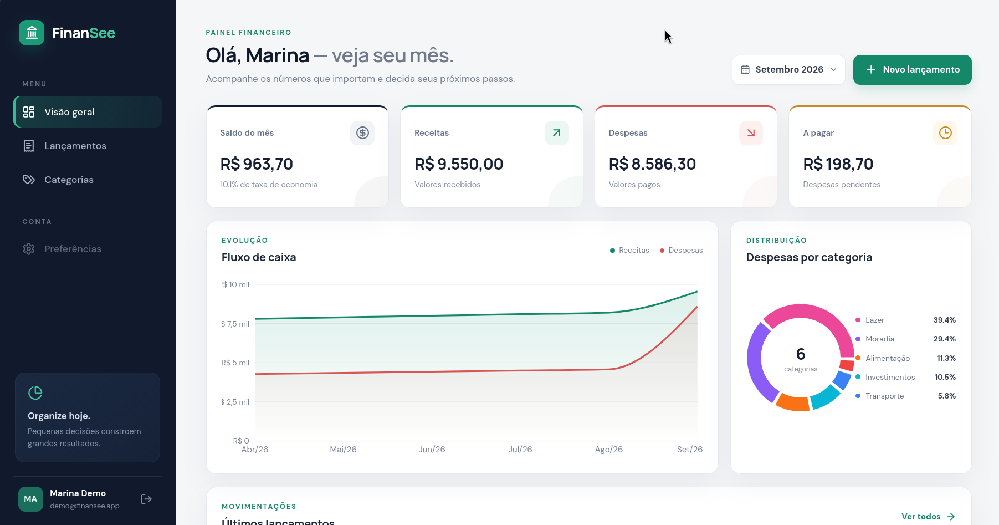
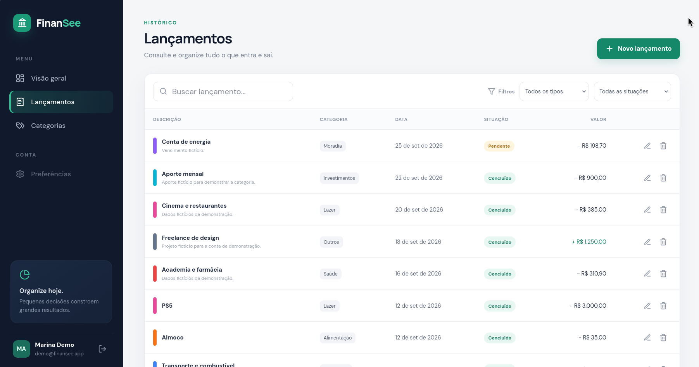
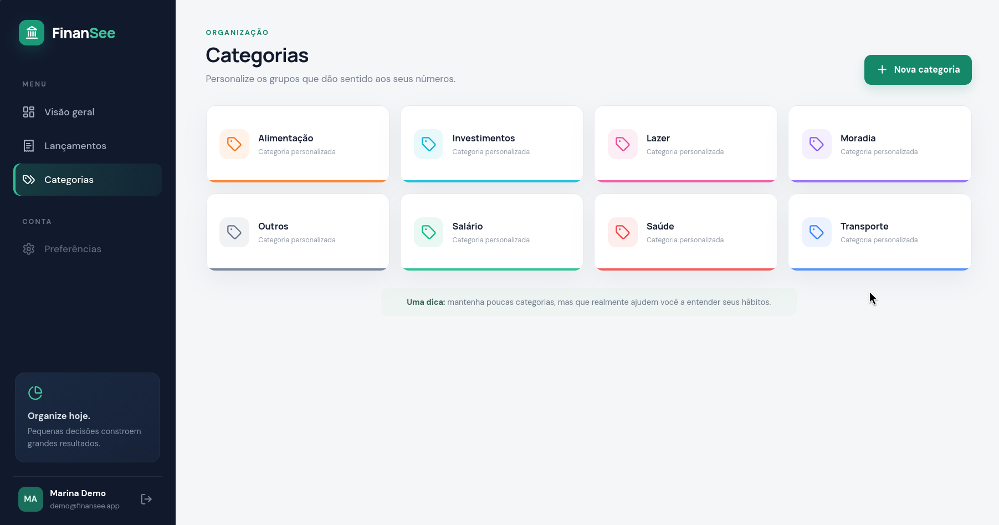
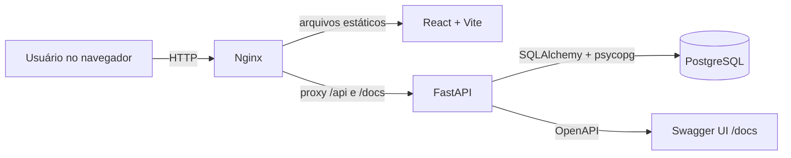

# FinanSee

Sistema financeiro pessoal full stack para registrar receitas e despesas, acompanhar o fluxo de caixa e entender a distribuição dos gastos.

O projeto foi criado como uma aplicação real para uso diário e, ao mesmo tempo, como uma peça de portfólio: arquitetura organizada, autenticação, isolamento de dados, migrations, testes, documentação automática e execução com Docker.

## Demonstração

Confira as principais telas do FinanSee com dados fictícios da conta de demonstração.

https://github.com/user-attachments/assets/a4c02a20-33b2-4e6a-8436-194cf5f0d72b

### Dashboard

Visão mensal do saldo, receitas, despesas e pendências, com gráficos de fluxo de caixa e
distribuição dos gastos por categoria.



### Lançamentos

Consulta de receitas e despesas com busca, filtros por tipo e situação e ações para gerenciar
cada lançamento.



### Categorias

Organização dos lançamentos em categorias personalizáveis, identificadas por nome, ícone e cor.



### Experimente localmente

Após [executar a aplicação com Docker](#executar-com-docker-recomendado), use **Acessar conta demo**
na tela de login ou informe:

```text
E-mail: demo@finansee.app
Senha:  Demo@FinanSee2026
```

> Todos os dados da demonstração são fictícios e seu conteúdo é restaurado quando o backend inicia.
> Use a conta demo para explorar o sistema com informações fictícias.

## O que a v1 entrega

- Cadastro e login com senha protegida por Argon2 e sessão via JWT;
- dashboard mensal com saldo, receitas, despesas, pendências e taxa de economia;
- gráfico de fluxo de caixa dos últimos seis meses;
- distribuição de despesas por categoria;
- CRUD completo de lançamentos, com busca, filtros e paginação;
- categorias personalizáveis e oito categorias iniciais por usuário;
- isolamento dos dados por usuário;
- interface responsiva para desktop e celular;
- API documentada automaticamente com OpenAPI;
- migrations com Alembic e testes de integração com Pytest;
- ambiente completo com Docker Compose e pipeline de CI para GitHub.

## Stack

| Camada | Tecnologias |
| --- | --- |
| Backend | Python 3.12, FastAPI, SQLAlchemy 2, Pydantic 2 |
| Banco | PostgreSQL 17, Alembic |
| Segurança | JWT, Argon2, separação de dados por usuário |
| Frontend | React 19, TypeScript, Vite, TanStack Query, Recharts |
| Qualidade | Pytest, Ruff, ESLint, GitHub Actions |
| Infraestrutura | Docker, Docker Compose, Nginx |

## Arquitetura



No Docker Compose, o Nginx serve o build do React e encaminha as chamadas da API para o FastAPI. No
desenvolvimento local, o Vite e o FastAPI executam separadamente para preservar o hot reload.

## Executar com Docker (recomendado)

Requisitos: [Docker Desktop](https://docs.docker.com/get-started/get-docker/) no Windows, macOS ou
Linux; ou Docker Engine com o plugin Compose no Linux.

Crie o arquivo local de configuração:

Linux e macOS:

```bash
cp .env.example .env
```

Windows PowerShell:

```powershell
Copy-Item .env.example .env
```

Em seguida, em qualquer sistema:

```bash
docker compose up --build
```

> Algumas instalações Linux exigem `sudo` nos comandos Docker até que o usuário seja autorizado a
> acessar o serviço. Consulte a documentação da sua distribuição ou do Docker Engine.

Depois, acesse:

- aplicação: <http://localhost>
- documentação da API: <http://localhost/docs>
- verificação de saúde: <http://localhost/health>

O backend aplica as migrations automaticamente ao iniciar. Os dados do PostgreSQL ficam persistidos no volume `postgres_data`.

## Desenvolvimento local

Requisitos locais:

- [Python 3.12 ou mais recente](https://www.python.org/downloads/);
- [Node.js 22](https://nodejs.org/en/download) e npm;
- pnpm 11.19.0;
- Make, opcional, para utilizar os atalhos da raiz em ambientes POSIX.

Depois de instalar Node.js e npm, instale a versão de pnpm usada pelo projeto:

```bash
npm install --global pnpm@11.19.0
```

Use o gerenciador de pacotes ou instalador apropriado ao seu sistema operacional para Python,
Node.js e Make.

### Banco

Suba apenas o PostgreSQL:

```bash
docker compose up database -d
```

### Backend

```bash
cd backend
python -m venv .venv
source .venv/bin/activate
python -m pip install -r requirements.txt
cp .env.example .env
alembic upgrade head
uvicorn app.main:app --reload
```

No Windows PowerShell, ative o ambiente e copie a configuração com:

```powershell
cd backend
python -m venv .venv
.\.venv\Scripts\Activate.ps1
python -m pip install -r requirements.txt
Copy-Item .env.example .env
alembic upgrade head
uvicorn app.main:app --reload
```

O arquivo `requirements.txt` reúne as dependências de execução, desenvolvimento e testes. O
`pyproject.toml` continua sendo a fonte principal de metadados e configuração do pacote.

A API estará em <http://localhost:8000>.

### Frontend

Em outro terminal:

```bash
cd frontend
cp .env.example .env
pnpm install --frozen-lockfile
pnpm dev
```

No Windows PowerShell, substitua a cópia por `Copy-Item .env.example .env`.

O frontend estará em <http://localhost:5173> e encaminhará chamadas `/api` para a API local.

## Testes e qualidade

```bash
# backend
cd backend
ruff check .
pytest --cov=app
cd ..

# frontend
cd frontend
pnpm lint
pnpm test
pnpm build
cd ..
```

Depois que os ambientes do backend e do frontend estiverem instalados, também é possível usar
`make test`, `make lint`, `make up` e `make down` na raiz. Os atalhos do backend usam diretamente
o ambiente virtual `backend/.venv`, portanto não é necessário ativá-lo antes. No Windows, use os
comandos diretos mostrados acima, pois os caminhos do Makefile seguem o padrão POSIX.

### Isolamento de sessão no frontend

As consultas de categorias, lançamentos e dashboard incluem o ID do usuário na chave do cache.
Ao sair, trocar de conta ou receber uma resposta de sessão inválida, o frontend limpa os caches
de consultas e mutações e cancela requisições pendentes. Respostas atrasadas da sessão anterior
não podem substituir o usuário atual. A troca de sessão também é sincronizada entre abas.
Essa limpeza afeta somente dados temporários do navegador; os lançamentos continuam no banco.

`pnpm test` executa os testes de regressão de sessão com Vitest e React Testing Library, usando
dados sintéticos e sem acessar o backend. Eles cobrem troca de contas na tela de categorias,
cancelamento de consultas, respostas atrasadas, expiração e sincronização entre abas. A CI
executa esses testes antes do build. Novas consultas privadas devem usar as chaves de
`src/lib/queryKeys.ts` e encaminhar o `signal` do TanStack Query para o Axios.

## Estrutura

```text
.
├── backend/
│   ├── alembic/              # migrations do banco
│   ├── requirements.txt      # dependências Python
│   ├── app/
│   │   ├── api/routes/       # endpoints HTTP
│   │   ├── core/             # configuração e segurança
│   │   ├── db/               # sessão SQLAlchemy
│   │   ├── models/           # entidades do domínio
│   │   ├── schemas/          # contratos Pydantic
│   │   └── services/         # regras reutilizáveis
│   └── tests/                # testes de integração
├── frontend/
│   └── src/
│       ├── components/       # componentes reutilizáveis
│       ├── lib/              # API, autenticação e formatação
│       ├── pages/            # telas da aplicação
│       └── types/            # contratos TypeScript
├── docs/images/             # capturas de tela da demonstração
├── .github/workflows/        # integração contínua
└── docker-compose.yml
```

## API principal

| Método | Rota | Descrição |
| --- | --- | --- |
| `POST` | `/api/v1/auth/register` | Cria usuário e categorias iniciais |
| `POST` | `/api/v1/auth/login` | Autentica e retorna JWT |
| `GET` | `/api/v1/auth/me` | Retorna o usuário autenticado |
| `GET/POST` | `/api/v1/categories` | Lista ou cria categorias |
| `PUT/DELETE` | `/api/v1/categories/{id}` | Atualiza ou remove categoria |
| `GET/POST` | `/api/v1/transactions` | Lista ou cria lançamentos |
| `GET/PATCH/DELETE` | `/api/v1/transactions/{id}` | Gerencia um lançamento |
| `GET` | `/api/v1/dashboard` | Consolida os dados do mês |

## Próximas versões

- Metas financeiras e orçamentos por categoria;
- lançamentos recorrentes e parcelamentos;
- múltiplas contas e cartões;
- importação de extratos CSV/OFX;
- exportação de relatórios;
- recuperação de senha e autenticação com dois fatores;
- testes E2E.

## Licença

Distribuído sob a licença MIT.
